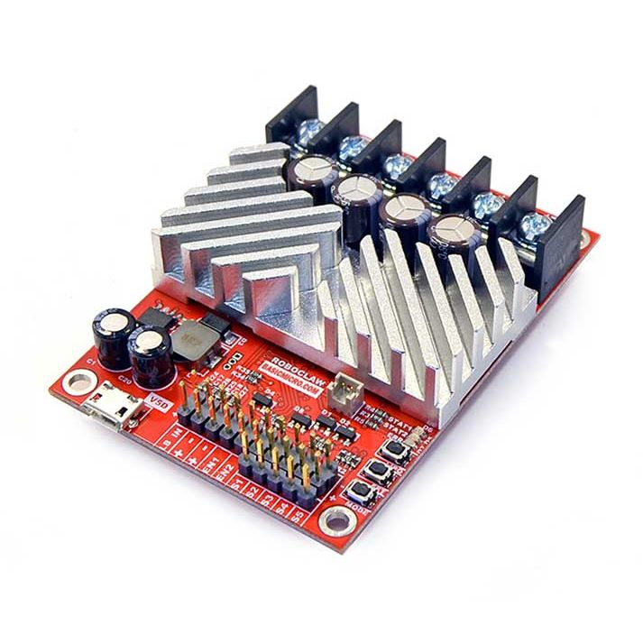

# Roboclaw Python Driver



This project is a python-based ROS 1.0 driver for the Roboclaw series of motor controllers. The driver is geared around the use case of a differential drive robot base and as such provides interfaces to control the robot using:

## Parameters

**port** := the serial port the roboclaw is connected to
**baud_rate** := the serial baud rate the device is configured for
**base_frame_id** := the base transform frame id
**base_width** := the distance between the two drive wheels
**ticks_per_metre** := the number of encoder pulses per metre of travel
**max_acceleration** := the maximium safe acceleration for the robot
**robot_direction** := this reverses the direction of the robot within both the odometry calculation and velocity commands
**left_motor_direction** := reverses only the direction of the left motor in the odometry and velocity commands
**right_motor_direction** := reverses only the direction of the right motor in the odometry and velocity commands
**KP** The proportional gain for the motor velocity PID controller
**KI** The integral gain for the motor velocity PID controller
**KD** The derivative gain for the motor velocity PID controller
**QPPS** The maximum encoder pulses per second and full speed, this is used by the velocity PID controller

## Topics

### Published

```
odom            nav_msgs/Odometry
joint_states    sensor_msgs/JointStates
roboclaw_state  roboclaw_pythonRoboclawState
```

### Subscribed

```
cmd_vel         geometry_msgs/Twist
```

## Additional Notes

Uses enum in pyhthon install using:

```
pip install enum34
```
